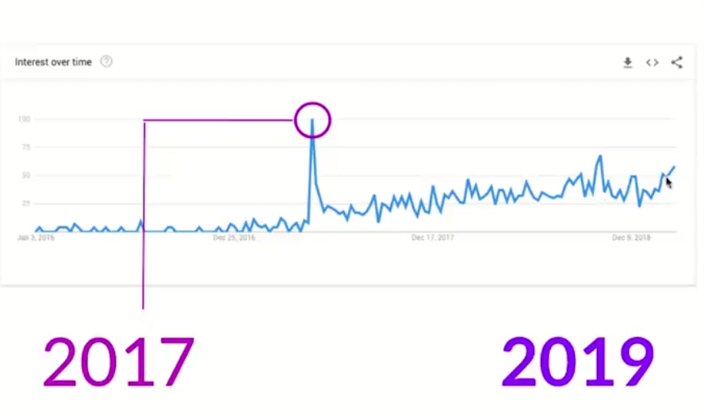
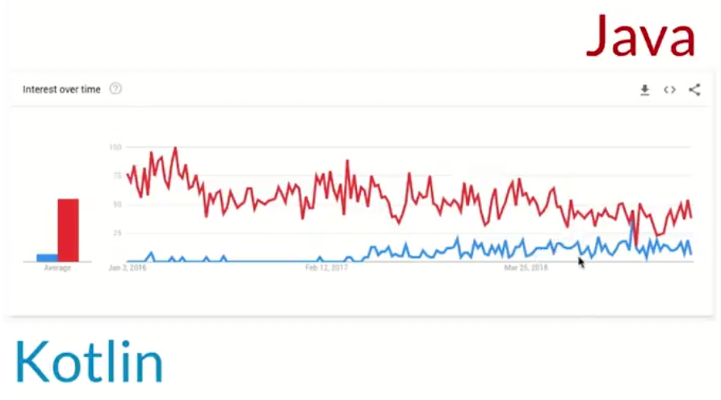
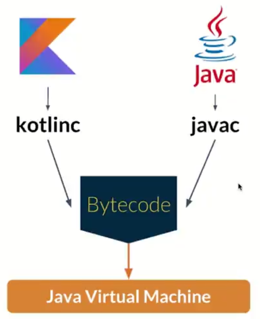

# Introducción
- Kotlin fue desarrollado desde 2010 
- Release 1.0 de Kotlin fue el 2016
- Actualidad Release 1.3 2020
- [https://kotlinlang.org/](https://kotlinlang.org/)

- Interes de kotlin

- kotlin Android y Java Android

# Caracteristicas
- Conciso - Reduce código
- Seguro - NullPointerException
- Interoperable - Podemos usarlo con Java

- Versátil - Diferentes tipo de aplicaciones
- Kotlin es multiplataforma
    - kotlin Server Side Ktor
    - Web KotlinJs
    - Android Mobile con Kotlin